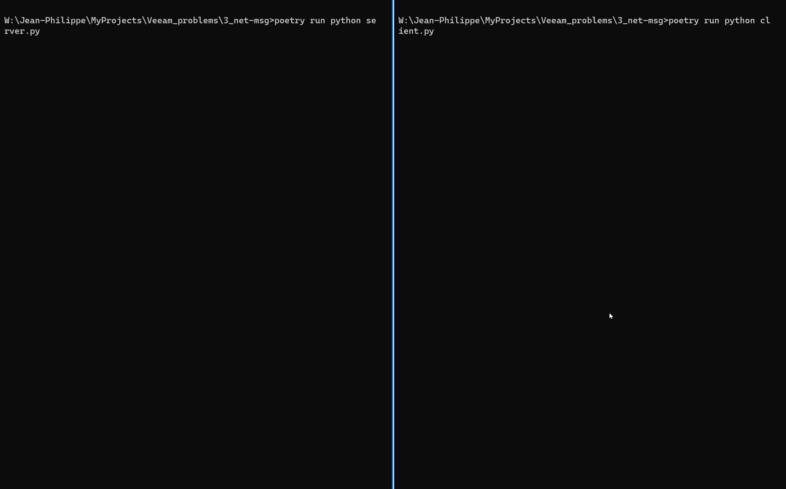

# net-msg

Python implementation of a simple client/server protocol, relying on [ØMQ](https://zeromq.org/) for messaging, via [PyZMQ](https://pyzmq.readthedocs.io/) bindings.

_Work-In-Progress_

## Installation

If you don't have [Poetry](https://python-poetry.org/) installed, I suggest [the new non-deprecated installer](https://python-poetry.org/docs/master/#installing-with-the-official-installer).

Then:

```
poetry install
```

## The client/server protocol

- The server listens on port 8000 for client registrations, and on port 8001 for client texts;
- registration of a client on the server: the client generates a UUID, provides it to the server, and gets a token back;
- client texting the server: the client provides a text message, with its UUID and its token, and gets an acknowledgement back if all good, or an error if the server has some problem identifying the client (UUID unrecognized, wrong token associated to the UUID); if all good, the server writes the provided message to a file.

## Running

Launching the server (for example, in a terminal window):

```
poetry run python server.py
```

Launching the client (for example, in another terminal window):

```
poetry run python client.py
```

Both server and client can be gracefully interrupted using Ctrl+C.

Another way is to use the management client (which currently uses the registration socket):

```
poetry run python server_ctrl.py
```

## Demo


